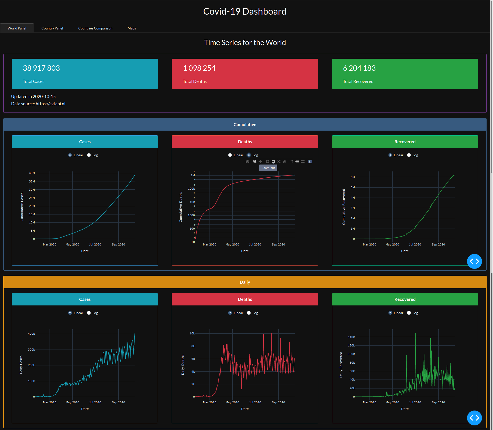
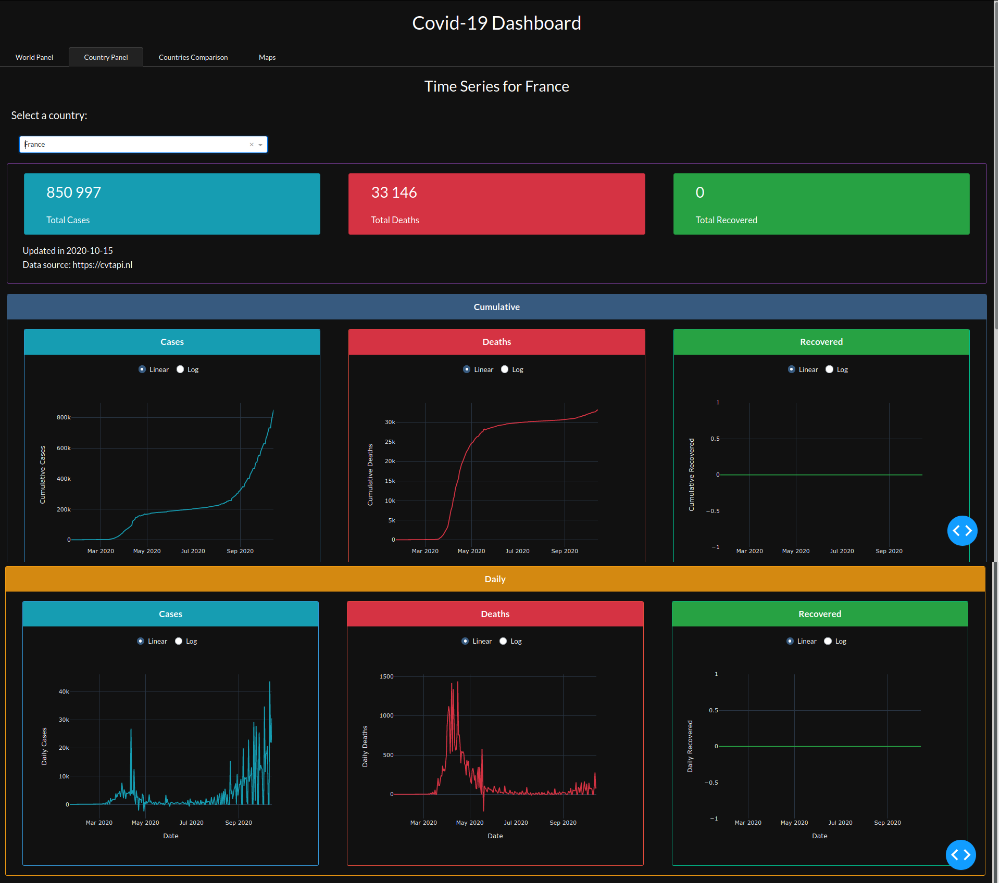
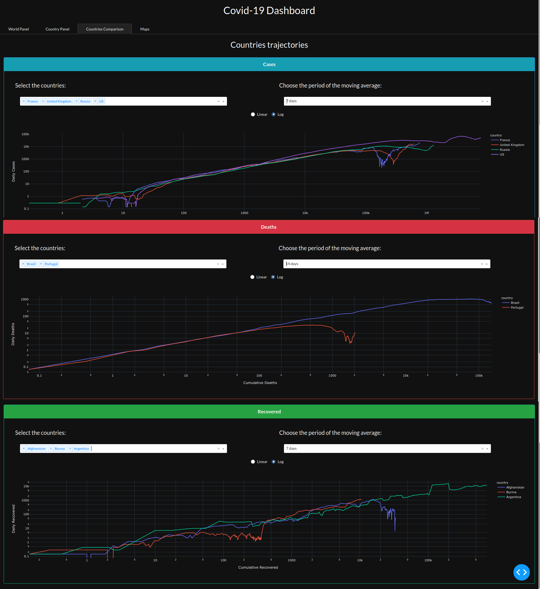
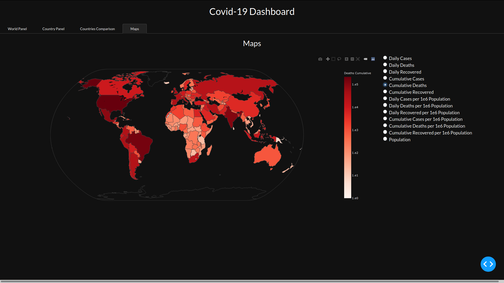

# Covid-19 Evolution Dashboard

### Dashboard url:
https://covid19-dashboard-python.herokuapp.com

Here you will see a panel of the confirmed cases of the Covid-19 global pandemic made with Python and Dash.
The data is updated nearly daily from the data source.

#### Covid-19 data source:
https://cvtapi.nl

### Screens:

